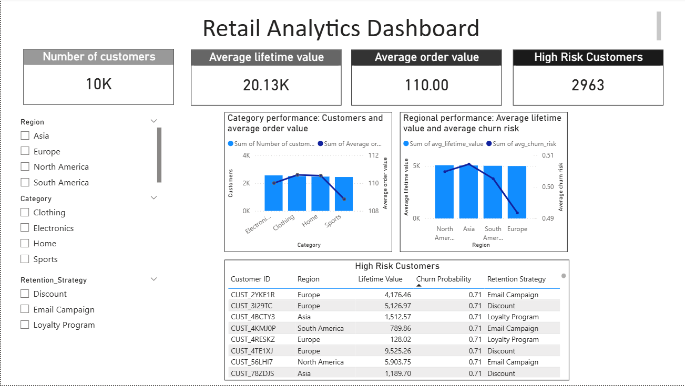

# Retail Analytics Dashboard (Databricks + Power BI)

## Project Overview
This project analyzes customer behavior using Databricks for data processing and Power BI for visualization.

The dashboard highlights:
- Category performance (customer count vs average order value)
- Regional customer lifetime value and churn risk
- Identification of high-risk customers and retention strategies

## Tools Used
- Databricks (PySpark)
- Power BI
- Python
- GitHub

## Dashboard Preview

## Key Insights
- Customer distribution is relatively uniform across product categories and regions, indicating a balanced customer base with no over-reliance on specific segments.
- Average customer lifetime value remains consistent across regions, suggesting similar long-term revenue potential irrespective of geography.
- Further segmentation at a more granular level may reveal deeper behavioral patterns and optimization opportunities.
